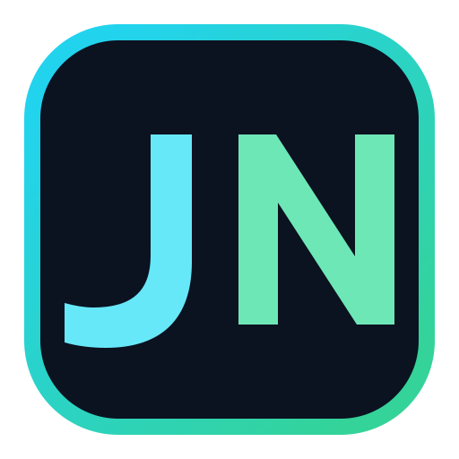

 

<picture>
  <source media="(prefers-color-scheme: dark)" srcset="JournalNevis_Wordmark_Dark.svg">
  <source media="(prefers-color-scheme: light)" srcset="JournalNevis_Wordmark_Light.svg">
  
</picture>

 

**Automated Trading Journal**  
*Trade automatically. Review intentionally.*

 

---

- [English](#english)
- [فارسی](#فارسی)

---

# English

## What is JournalNevis?

JournalNevis is a free automated trading journal project.

It is built to reduce manual logging work and help traders keep a cleaner record of:
- closed trades
- entry and exit screenshots
- symbol performance
- win rate
- profit and loss
- account activity
- Google Drive screenshot links

The current release connects:
- a MetaTrader-side journal tool
- a Google Apps Script backend
- a Google Sheets dashboard
- Google Drive for screenshots

---

## Main idea

JournalNevis is made for traders who want:
- less manual documentation
- a cleaner trade journal
- better review after trading
- one place for screenshots and statistics

---

## Current repository content

This repository currently includes:

- `JournalNevis_v5_7.gs` → Google Apps Script backend
- `JournalNevis_v5_7_Template.xlsx` → journal template
- `JournalNevis_Icon.svg` → project icon
- `JournalNevis_Wordmark_Dark.svg` → dark mode wordmark
- `JournalNevis_Wordmark_Light.svg` → light mode wordmark
- `JOURNALNEVIS_v5_7_FINAL_REVIEW.txt` → review notes
- `JOURNALNEVIS_v5_7_README.md` → project notes

> The MetaTrader executable/source can be shared separately depending on the release policy.

---

## Features

- automatic trade recording
- screenshot support
- Google Drive integration
- Google Sheets dashboard
- symbol-based summary
- performance review support
- free to use

---

## Typical workflow

1. A trade is closed.
2. JournalNevis collects the trade data.
3. Screenshot files are uploaded or linked.
4. Google Sheets is updated.
5. The dashboard refreshes.

---

## Notes

- This project is free.
- It is being improved step by step.
- If you want to support development, a donation page may be added later.

---

# فارسی

## JournalNevis چیست؟

JournalNevis یک پروژه رایگان برای **ژورنال‌نویسی خودکار معاملات** است.

هدف این پروژه این است که ثبت دستی معاملات کمتر شود و معامله‌گر بتواند اطلاعات خود را تمیزتر و سریع‌تر نگه دارد، مثل:

- معاملات بسته‌شده
- اسکرین‌شات ورود و خروج
- عملکرد هر نماد
- نرخ برد
- سود و زیان
- فعالیت‌های حساب
- لینک تصاویر در Google Drive

نسخه فعلی از این بخش‌ها تشکیل شده است:

- ابزار سمت متاتریدر
- بک‌اند Google Apps Script
- داشبورد Google Sheets
- ذخیره تصاویر در Google Drive

---

## ایده اصلی

JournalNevis برای معامله‌گرهایی ساخته شده که می‌خواهند:

- ژورنال‌نویسی دستی کمتر شود
- اطلاعات معاملات‌شان تمیزتر باشد
- مرور معاملات راحت‌تر شود
- آمار و تصاویر را یکجا داشته باشند

---

## فایل‌های موجود در این مخزن

در حال حاضر این مخزن شامل این فایل‌هاست:

- `JournalNevis_v5_7.gs` → کد Google Apps Script
- `JournalNevis_v5_7_Template.xlsx` → قالب ژورنال
- `JournalNevis_Icon.svg` → آیکن پروژه
- `JournalNevis_Wordmark_Dark.svg` → وردمارک برای dark mode
- `JournalNevis_Wordmark_Light.svg` → وردمارک برای light mode
- `JOURNALNEVIS_v5_7_FINAL_REVIEW.txt` → یادداشت بازبینی
- `JOURNALNEVIS_v5_7_README.md` → توضیحات پروژه

> فایل اجرایی یا سورس متاتریدر می‌تواند بسته به سیاست انتشار، جداگانه قرار داده شود.

---

## قابلیت‌ها

- ثبت خودکار معامله
- پشتیبانی از اسکرین‌شات
- اتصال به Google Drive
- داشبورد در Google Sheets
- تحلیل بر اساس نماد
- مناسب برای مرور و بررسی معاملات
- رایگان

---

## روند کلی کار

1. معامله بسته می‌شود.
2. JournalNevis اطلاعات معامله را می‌خواند.
3. اسکرین‌شات‌ها آپلود یا لینک می‌شوند.
4. Google Sheets به‌روزرسانی می‌شود.
5. داشبورد اطلاعات جدید را نمایش می‌دهد.

---

## توضیح

- این پروژه رایگان است.
- توسعه آن به‌صورت مرحله‌ای انجام می‌شود.
- اگر در آینده بخواهی، بخش donation هم می‌تواند به آن اضافه شود.

---

### JournalNevis  
**Free automated trading journal**

