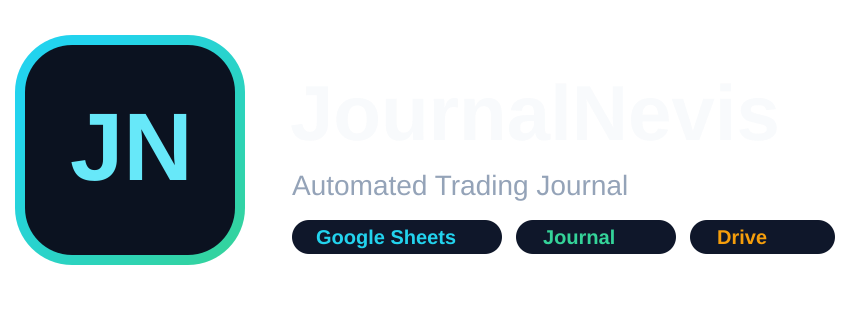

<div align="center">

<picture>
  <source media="(prefers-color-scheme: dark)" srcset="JournalNevis_Wordmark_Dark.svg">
  <source media="(prefers-color-scheme: light)" srcset="JournalNevis_Wordmark_Light.svg">
  
</picture>

<br>

### Automated Trading Journal

**Trade automatically. Review intentionally.**

<br>


<br>

[English](#english) · [فارسی](#persian)

</div>

---

<a id="english"></a>

# English

## Overview

**JournalNevis** is a free automated trading-journal project built to reduce the manual work involved in recording and reviewing trades.

Version **5.8** adds proper **multi-account dashboard management**. Multiple trading accounts can write into the same Google Sheet, while the Dashboard calculates and displays **one selected account at a time**.

The current release connects a JournalNevis Expert Advisor to a Google Apps Script backend. Trade data is stored in Google Sheets, while entry and exit screenshots are stored in Google Drive and linked back to the corresponding trade.

The goal is simple:

> **Spend less time copying trade data and more time reviewing decisions, setups, mistakes, and performance.**

JournalNevis can help answer questions such as:

- Which symbols do I trade most?
- What is my win rate by symbol?
- How much am I paying in commissions?
- What is my account drawdown?
- Which setups perform better?
- Do certain emotions or mistakes appear repeatedly?
- What did the chart look like when I entered or exited?

> [!IMPORTANT]
> JournalNevis is a **journal and analytics tool**.  
> It does **not** open, modify, or close trades.

---

## Table of contents

- [Features](#features)
- [How JournalNevis works](#how-journalnevis-works)
- [Installation](#installation)
- [First setup](#first-setup)
- [Using JournalNevis](#using-journalnevis)
- [SYNC TODAY vs FULL SYNC](#sync-today-vs-full-sync)
- [Screenshots and recovery](#screenshots-and-recovery)
- [v5.8 screenshot-link repair](#v571-screenshot-link-repair)
- [Dashboard](#dashboard)
- [Trades sheet](#trades-sheet)
- [Manual review fields](#manual-review-fields)
- [Privacy](#privacy)
- [Project status](#project-status)
- [Roadmap](#roadmap)
- [Disclaimer](#disclaimer)

---

## What's new in v5.8

### Multi-account Dashboard

The Dashboard now has an **ACCOUNT VIEW** selector. When you choose an account, JournalNevis recalculates the Dashboard only for that account.

The selected account controls:

- Balance and Equity
- Initial Capital
- Net P/L
- Win Rate
- Profit Factor
- Drawdown
- Commission
- Winning and losing streaks
- Symbol Performance
- Monthly P/L
- Dashboard charts

Data from other connected accounts is not mixed into the selected account's Dashboard.

### Shared Trades sheet

All connected accounts continue to use the same **Trades** sheet. Account Login, Server and trade identifiers keep trades from different accounts separated.

### Account-scoped cash flow

Deposits, withdrawals, Initial Capital, Running Cash Flow and balance-curve calculations are separated by account.

### Account removal

An account can be removed from the spreadsheet through:

```text
JournalNevis v5.8
→ Advanced
→ Delete Selected Account Data...
```

Google Drive screenshots are intentionally **not** deleted by this command.

### Better CPU portability

For a public `.ex5` intended to run on different x64 computers, compile `JournalNevis_v5_8.mq5` using:

```text
X64 Regular
```

This avoids requiring AVX2 on older compatible x64 systems.

---

## Features

| Feature | What it does |
|---|---|
| **Automatic trade logging** | Records live transactions and can rebuild trade history from the account. |
| **Multi-account journal** | Multiple accounts can write to one spreadsheet. |
| **Account-selected Dashboard** | Dashboard statistics are scoped to one selected account at a time. |
| **Entry screenshots** | Captures the chart around trade entry. |
| **Exit screenshots** | Captures the chart around trade exit. |
| **Google Drive storage** | Stores trade screenshots in the user's own Drive. |
| **Google Sheets journal** | Writes trade information into a structured journal. |
| **Professional dashboard** | Shows P/L, drawdown, win rate, symbol statistics, streaks and charts. |
| **Symbol performance** | Tracks results separately for each traded symbol. |
| **Funding tracking** | Can track deposits, withdrawals and account-level cash events. |
| **Screenshot recovery** | Can relink or re-upload previously saved screenshots. |
| **SYNC TODAY** | Checks only today's relevant activity. |
| **FULL SYNC** | Performs a full historical reconciliation. |
| **Manual trade review** | Setup, Entry Reason, Emotion, Mistake, Notes and Review Status remain editable. |
| **Local screenshot cache** | Existing screenshot files can be reused after rebuilding the cloud journal. |

---

## How JournalNevis works

```text
      Trading Account A ── JournalNevis ──┐
                                          │
      Trading Account B ── JournalNevis ──┼──► Google Apps Script
                                          │            │
      Trading Account C ── JournalNevis ──┘            │
                                                       ├──► Google Sheets
                                                       │    Trades
                                                       │    Dashboard
                                                       │    Accounts
                                                       │
                                                       └──► Google Drive
                                                            Entry / Exit images
```

The repository and future JournalNevis website are used for distribution and documentation.

The normal journaling workflow does **not** require a central JournalNevis trade database.

---

# Multi-account design

## Dashboard

The Dashboard displays **one account at a time**.

The selector uses an account key based on:

```text
Account Login | Server
```

Changing the account in **ACCOUNT VIEW** refreshes the Dashboard for that account only.

A newly connected account is added to the selector without forcing a switch away from the account you are already viewing.

## Trades

All accounts share the same **Trades** sheet. JournalNevis keeps them separate internally using Account Login, Server, Position ID and Trade Key information.

## Accounts

The **Accounts** sheet stores the latest snapshot for each connected account, including items such as Balance, Equity, Currency, Floating P/L, Margin and Last Updated.

---

# Installation

## 1. Create your Google journal

Upload:

```text
JournalNevis_v5_8_Template.xlsx
```

to Google Drive and open it using **Google Sheets**.

The main visible sheets are:

- **Dashboard**
- **Trades**
- **Accounts**
- **Settings**
- **Help**

Supporting calculation sheets may remain hidden.

---

## 2. Install the Google Apps Script backend

Inside the Google Sheet, open:

```text
Extensions → Apps Script
```

Remove the default code and paste the content of the current JournalNevis Apps Script file.

Save the project.

Then run:

```javascript
setupJournalNevis()
```

once.

Google may ask you to authorize the script.

---

## 3. Deploy the Web App

In Apps Script:

```text
Deploy
→ New deployment
→ Web app
```

Create the deployment and copy the production URL.

The URL used by JournalNevis should end with:

```text
/exec
```

JournalNevis also uses an **API Secret** to protect requests between the Expert Advisor and the Google backend.

> [!CAUTION]
> Never publish your personal API Secret in GitHub, screenshots, public `.set` files, forum posts, or tutorials.

---

## 4. Allow WebRequest

In MetaTrader:

```text
Tools
→ Options
→ Expert Advisors
```

Enable WebRequest and add the required Google Apps Script address/domain.

---

## 5. Install JournalNevis

Copy:

```text
JournalNevis_v5_8.ex5
```

to the appropriate Expert Advisors folder.

For the current MT5 integration:

```text
MQL5/Experts
```

Restart the terminal or refresh **Navigator → Expert Advisors**.

Attach JournalNevis to a dedicated chart and enter:

- Web App `/exec` URL
- API Secret
- Journal role/settings

For the main account journal, use the **MASTER** role.

---

# First setup

For a completely new journal:

1. Create/import the new Google Sheet.
2. Install the Apps Script.
3. Run `setupJournalNevis()`.
4. Deploy the Web App.
5. Add the WebRequest address in the trading terminal.
6. Attach JournalNevis.
7. Confirm the connection.
8. Run **FULL SYNC** once for the currently connected account.
9. Repeat the initial FULL SYNC from each additional account you want to add.

The sync is processed in four stages:

```text
Stage 1/4  Account / funding
Stage 2/4  Trades / executions
Stage 3/4  Screenshots
Stage 4/4  Dashboard / finalize
```

After the initial rebuild, normal daily use usually does **not** require FULL SYNC again.

---

# Using JournalNevis

## Live trades

When a trade event is detected, JournalNevis can:

1. identify the trade,
2. capture the relevant chart screenshot,
3. store trade information,
4. upload the screenshot,
5. link it to the correct trade,
6. update the account journal.

Trade data and screenshots are handled separately so that a screenshot problem does not have to prevent the trade itself from being recorded.

---

## MASTER and screenshot charts

A MASTER instance is responsible for account-level journaling and reconciliation.

If you want accurate screenshots for multiple symbols, you can use dedicated screenshot instances on those symbol charts.

Example:

```text
XAUUSD chart → MASTER
USDJPY chart → Screenshot Agent
US30 chart   → Screenshot Agent
```

The trade can still be opened from another chart, another Expert Advisor, or another device.

---

# SYNC TODAY vs FULL SYNC

## SYNC TODAY

Use **SYNC TODAY** for routine reconciliation.

It focuses on the current trading day rather than repeatedly scanning the entire account history.

Typical use:

```text
Trade normally
→ Live logging runs automatically
→ Press SYNC TODAY when you want a daily reconciliation
```

## FULL SYNC

Use **FULL SYNC** when you intentionally want a complete rebuild or audit for the account currently connected to that MetaTrader terminal.

Recommended situations:

- first installation,
- a new Google Sheet,
- rebuilding deleted journal data,
- repairing historical trades,
- recovering old screenshot links,
- checking the complete available account history.

> [!TIP]
> FULL SYNC is a repair/rebuild tool, not a button that needs to be pressed after every trade.

---

# Screenshots and recovery

JournalNevis supports entry and exit images.

Screenshots are:

1. captured from the dedicated chart,
2. saved locally,
3. uploaded to Google Drive,
4. linked to the trade row.

The local cache is useful if the cloud journal is rebuilt later.

Supported screenshot generations currently include names beginning with:

```text
JN58_
JN57_
JN56_
TJ5_
```

This allows newer releases to recover images created by older versions.

---

# Screenshot-link repair carried into v5.8

Version **5.7.1** addresses a specific situation discovered during testing:

> Screenshots were successfully present in Google Drive, and the journal recognized that the trades had screenshots, but the screenshot links were not added to the Trades sheet.

The repair improves the matching process by using multiple identifiers and searching the Drive screenshot structure more reliably.

It can:

- match by **Trade Key**,
- fall back to **Position ID**,
- inspect nested screenshot folders,
- inspect `UNKNOWN` folders,
- recognize `JN57_`, `JN56_`, and legacy `TJ5_` names,
- preserve already-correct links,
- restore missing Entry/Exit links without re-uploading images that already exist.

After installing the v5.8 Apps Script, use:

```text
JournalNevis
→ Repair Screenshot Links
```

A repair report can show:

```text
Links restored: 7
Already linked: 12
Unmatched image files: 0
```

---

# Dashboard

The Dashboard is designed to provide a fast account-level overview.

### Account snapshot
- Balance
- Equity
- Initial Capital
- Floating P/L

### Performance
- Total Net Profit
- Gross Profit
- Gross Loss
- Profit Factor
- Expected Payoff
- Recovery Factor
- Win Rate
- Total Trades

### Drawdown
- Absolute Drawdown
- Maximal Drawdown
- Maximum Drawdown %
- Relative Drawdown
- Minimum Balance

### Symbol performance
- Trades
- Wins
- Losses
- Win Rate
- Net P/L
- Profit Factor
- Commission
- Average Trade
- Best Trade
- Worst Trade
- Average Holding Time
- Volume
- Long / Short count

### Charts
- Balance Curve
- Drawdown
- Net P/L by Symbol
- Win Rate by Symbol
- Monthly P/L
- Wins vs Losses

---

# Trades sheet

The Trades sheet combines automatically recorded trade information with manual review fields.

Typical automatic fields include:

- Symbol
- Direction
- Volume
- Open / Close Time
- Entry / Exit Price
- Stop Loss
- Take Profit
- Exit Reason
- Gross P/L
- Commission
- Swap
- Fee
- Net P/L
- Holding Time
- Source
- Entry Screenshot
- Exit Screenshot
- Status

---

# Manual review fields

Automation records **what happened**.  
A good journal also records **why it happened**.

| Field | Example |
|---|---|
| **Setup** | Pullback |
| **Entry Reason** | Retest after breakout |
| **Emotion** | Calm |
| **Mistake** | Early Entry |
| **Notes** | Entered before confirmation |
| **Review Status** | Reviewed |

Several fields include dropdown choices to make reviews faster and more consistent.

---

# Removing an account

First select the account in the Dashboard **ACCOUNT VIEW** dropdown.

Then use:

```text
JournalNevis v5.8
→ Advanced
→ Delete Selected Account Data...
```

After confirmation, JournalNevis removes that account from:

- Trades
- Executions
- Cash Flow
- Accounts
- Equity History

> [!IMPORTANT]
> Google Drive screenshots are **not deleted**.

---

# CPU compatibility / X64 Regular

If MetaTrader reports:

```text
your CPU architecture does not allow to run the file:
AVX2 required, you have AVX only

loading failed [568]
```

the `.ex5` was compiled for a CPU architecture that is not supported by that computer.

For a portable public build:

```text
MetaEditor
→ CPU architecture
→ X64 Regular
→ Compile
```

Verify that the build log reports:

```text
0 errors, 0 warnings
```

An EX5 already compiled for AVX2 cannot be made compatible with an AVX-only CPU by changing an EA input. It must be recompiled from the source using a compatible target.

---

# Privacy

In the current architecture:

- the Apps Script is deployed by **you**,
- the spreadsheet belongs to **you**,
- screenshots are stored in **your Google Drive**,
- the API Secret remains under **your control**.

JournalNevis does not require a central JournalNevis trade-history database for this workflow.

---

# Project status

JournalNevis is currently provided **free of charge**.

The project is being developed iteratively based on real usage and testing.

The public release can include compiled components without requiring the full source code of every component to be published.

---

# Roadmap

Ideas being considered include:

- easier installation,
- improved onboarding,
- account aliases,
- portfolio-level multi-account views,
- more behavioral analytics,
- more dashboard reports,
- easier update workflow,
- improved documentation,
- JournalNevis.ir documentation portal,
- additional trading-platform integrations.

> [!NOTE]
> Roadmap items are ideas under consideration, not guaranteed features.

---

# Support the project

JournalNevis is free.

A voluntary donation/support option may be added later for users who want to help continued development, documentation, testing, and hosting.

Core downloads are intended to remain accessible without requiring a donation.

---

# Disclaimer

JournalNevis is a journaling and analytics tool.

It does not provide investment advice, trading signals, profit guarantees, or protection from trading losses.

---

<a id="persian"></a>

<div dir="rtl" align="right">

<h1>فارسی</h1>

<h2>معرفی JournalNevis</h2>

<p>
<strong>JournalNevis</strong> یک پروژه رایگان برای <strong>ژورنال‌نویسی خودکار معاملات</strong> است.
هدف پروژه این است که کارهای تکراری ثبت معامله کمتر شود و معامله‌گر زمان بیشتری را صرف مرور معاملات، بررسی روش‌های ورود، شناخت اشتباهات و تحلیل عملکرد کند.
</p>

<p>
در نسخه <span dir="ltr"><code>5.8</code></span>، پشتیبانی واقعی از چند حساب به داشبورد اضافه شده است.
چند حساب می‌توانند اطلاعات خود را در یک فایل مشترک نگهداری کنند، اما داشبورد در هر لحظه فقط اطلاعات <strong>یک حساب انتخاب‌شده</strong> را محاسبه و نمایش می‌دهد.
</p>

<p>
اطلاعات معاملات از ابزار سمت پلتفرم معاملاتی دریافت می‌شود، از طریق
<span dir="ltr"><code>Google Apps Script</code></span>
به
<span dir="ltr"><code>Google Sheets</code></span>
فرستاده می‌شود و تصاویر ورود و خروج در
<span dir="ltr"><code>Google Drive</code></span>
ذخیره می‌شوند.
</p>

<blockquote>
<strong>کمتر اطلاعات را دستی وارد کن؛ بیشتر معاملاتت را بررسی کن.</strong>
</blockquote>

<p>
<strong>نکته مهم:</strong>
JournalNevis یک ابزار ژورنال و تحلیل است و خودش هیچ معامله‌ای را باز، بسته یا ویرایش نمی‌کند.
</p>

<hr>

<h2>تغییرات اصلی نسخه 5.8</h2>

<h3>داشبورد چندحسابی</h3>

<p>
در بالای داشبورد بخش
<span dir="ltr"><code>ACCOUNT VIEW</code></span>
قرار دارد.
با انتخاب هر حساب، تمام محاسبات داشبورد فقط برای همان حساب انجام می‌شوند.
</p>

<ul>
<li><span dir="ltr"><code>Balance</code></span> و <span dir="ltr"><code>Equity</code></span></li>
<li><span dir="ltr"><code>Initial Capital</code></span></li>
<li><span dir="ltr"><code>Net P/L</code></span></li>
<li><span dir="ltr"><code>Win Rate</code></span></li>
<li><span dir="ltr"><code>Profit Factor</code></span></li>
<li><span dir="ltr"><code>Drawdown</code></span></li>
<li><span dir="ltr"><code>Commission</code></span></li>
<li>روندهای برد و باخت متوالی</li>
<li>عملکرد هر نماد</li>
<li>سود و زیان ماهانه</li>
<li>تمام نمودارهای داشبورد</li>
</ul>

<p>
اطلاعات حساب‌های دیگر با داشبورد حساب انتخاب‌شده ترکیب نمی‌شوند.
</p>

<h3>جریان مالی مستقل برای هر حساب</h3>

<p>
واریز، برداشت، سرمایه اولیه، جریان نقدی تجمعی و منحنی موجودی برای هر حساب جداگانه محاسبه می‌شوند.
</p>

<h3>حذف حساب از فایل</h3>

<p>
در بخش پیشرفته می‌توانی حساب انتخاب‌شده را از فایل حذف کنی، بدون اینکه تصاویر موجود در
<span dir="ltr"><code>Google Drive</code></span>
پاک شوند.
</p>

<h3>سازگاری بهتر با پردازنده‌های مختلف</h3>

<p>
برای نسخه عمومی فایل اجرایی پیشنهاد می‌شود فایل با هدف
<span dir="ltr"><code>X64 Regular</code></span>
کامپایل شود.
</p>

<hr>

<h2>قابلیت‌های اصلی</h2>

<ul>
<li>ثبت خودکار معاملات زنده و تاریخچه حساب</li>
<li>پشتیبانی از چند حساب در یک فایل مشترک</li>
<li>داشبورد مستقل برای حساب انتخاب‌شده</li>
<li>ذخیره تصویر ورود با عنوان <span dir="ltr"><code>Entry Screenshot</code></span></li>
<li>ذخیره تصویر خروج با عنوان <span dir="ltr"><code>Exit Screenshot</code></span></li>
<li>ذخیره تصاویر در <span dir="ltr"><code>Google Drive</code></span> خود کاربر</li>
<li>ثبت اطلاعات معاملات در <span dir="ltr"><code>Google Sheets</code></span></li>
<li>تحلیل عملکرد هر نماد</li>
<li>محاسبه افت سرمایه برای حساب انتخاب‌شده</li>
<li>ثبت واریز و برداشت برای هر حساب</li>
<li>بازیابی تصاویر و لینک‌های قدیمی</li>
<li>همگام‌سازی روزانه با <span dir="ltr"><code>SYNC TODAY</code></span></li>
<li>بازسازی کامل با <span dir="ltr"><code>FULL SYNC</code></span></li>
<li>ثبت دستی روش ورود، دلیل ورود، احساس، اشتباه، یادداشت و وضعیت بررسی</li>
</ul>

<hr>

<h2>ساختار چندحسابی</h2>

<pre dir="ltr"><code>Account A → JournalNevis ─┐
                          │
Account B → JournalNevis ─┼──► Google Apps Script
                          │            │
Account C → JournalNevis ─┘            │
                                       ├──► Google Sheets
                                       │    Trades / Dashboard / Accounts
                                       │
                                       └──► Google Drive
                                            Entry / Exit Screenshots</code></pre>

<p>
هر ترمینال فقط تاریخچه حسابی را می‌خواند که در همان لحظه به آن متصل است.
فایل Google Sheet محل جمع‌شدن اطلاعات حساب‌های مختلف است.
</p>

<hr>

<h2>مدیریت چند حساب</h2>

<p>
در داشبورد از بخش
<span dir="ltr"><code>ACCOUNT VIEW</code></span>
می‌توانی حساب موردنظر را انتخاب کنی.
</p>

<p>
کلید هر حساب بر اساس ترکیب شماره ورود و سرور ساخته می‌شود:
</p>

<pre dir="ltr"><code>Account Login | Server</code></pre>

<p>برای مثال:</p>

<pre dir="ltr"><code>20279432 | WMMarkets-Demo
58423981 | WMMarkets-Demo</code></pre>

<p>
تمام حساب‌ها همچنان داخل یک برگه مشترک با نام
<span dir="ltr"><code>Trades</code></span>
نگهداری می‌شوند.
JournalNevis با استفاده از اطلاعات حساب، سرور و شناسه‌های معامله، معاملات حساب‌های مختلف را از هم جدا نگه می‌دارد.
</p>

<p>
برگه
<span dir="ltr"><code>Accounts</code></span>
آخرین وضعیت هر حساب متصل را نگهداری می‌کند.
</p>

<hr>

<h2>آموزش نصب نسخه 5.8</h2>

<h3>مرحله ۱ — ساخت فایل Google Sheet</h3>

<p>
فایل
<span dir="ltr"><code>JournalNevis_v5_8_Template.xlsx</code></span>
را داخل
<span dir="ltr"><code>Google Drive</code></span>
آپلود کن و با
<span dir="ltr"><code>Google Sheets</code></span>
باز کن.
</p>

<p>برگه‌های اصلی:</p>

<ul>
<li><span dir="ltr"><code>Dashboard</code></span></li>
<li><span dir="ltr"><code>Trades</code></span></li>
<li><span dir="ltr"><code>Accounts</code></span></li>
<li><span dir="ltr"><code>Settings</code></span></li>
<li><span dir="ltr"><code>Help</code></span></li>
</ul>

<h3>مرحله ۲ — نصب Google Apps Script</h3>

<p>از داخل فایل Google Sheet وارد مسیر زیر شو:</p>

<pre dir="ltr"><code>Extensions → Apps Script</code></pre>

<p>
محتوای فایل
<span dir="ltr"><code>JournalNevis_v5_8_1_LinkPersistenceFix.gs</code></span>
را جای‌گذاری و ذخیره کن.
سپس یک بار تابع زیر را اجرا کن:
</p>

<pre dir="ltr"><code>setupJournalNevis()</code></pre>

<p>
در اولین اجرا ممکن است Google برای دسترسی‌های موردنیاز درخواست تأیید نمایش دهد.
</p>

<h3>مرحله ۳ — ساخت Web App</h3>

<p>از مسیر زیر استفاده کن:</p>

<pre dir="ltr"><code>Deploy
→ New deployment
→ Web app</code></pre>

<p>
آدرس نهایی مورد استفاده JournalNevis باید به
<span dir="ltr"><code>/exec</code></span>
ختم شود.
</p>

<p>
مقدار شخصی
<span dir="ltr"><code>API Secret</code></span>
را در GitHub یا تصاویر و فایل‌های عمومی منتشر نکن.
</p>

<h3>مرحله ۴ — فعال‌کردن WebRequest</h3>

<p>داخل MetaTrader از مسیر زیر برو:</p>

<pre dir="ltr"><code>Tools
→ Options
→ Expert Advisors</code></pre>

<p>
دسترسی
<span dir="ltr"><code>WebRequest</code></span>
را فعال کن و آدرس موردنیاز Google Apps Script را اضافه کن.
</p>

<h3>مرحله ۵ — کامپایل Expert</h3>

<p>
فایل
<span dir="ltr"><code>JournalNevis_v5_8.mq5</code></span>
را در MetaEditor باز کن.
</p>

<p>
برای نسخه‌ای که قرار است روی کامپیوترهای مختلف اجرا شود، معماری پردازنده را روی گزینه زیر قرار بده:
</p>

<pre dir="ltr"><code>X64 Regular</code></pre>

<p>بعد کامپایل کن و بررسی کن که گزارش ساخت مقدار زیر را نشان دهد:</p>

<pre dir="ltr"><code>0 errors, 0 warnings</code></pre>

<p>
برای انتشار عمومی فقط فایل اجرایی ساخته‌شده با
<span dir="ltr"><code>X64 Regular</code></span>
را منتشر کن.
</p>

<hr>

<h2>اولین راه‌اندازی</h2>

<ol>
<li>قالب نسخه 5.8 را وارد کن.</li>
<li>اسکریپت نسخه 5.8 را نصب کن.</li>
<li>تابع <span dir="ltr"><code>setupJournalNevis()</code></span> را اجرا کن.</li>
<li>وب‌اپ را منتشر کن.</li>
<li>Expert را با <span dir="ltr"><code>X64 Regular</code></span> کامپایل کن.</li>
<li>JournalNevis را به حساب اول متصل کن.</li>
<li>اتصال را بررسی کن.</li>
<li>برای حساب اول یک بار <span dir="ltr"><code>FULL SYNC</code></span> اجرا کن.</li>
<li>برای هر حساب دیگری که می‌خواهی اضافه کنی، همگام‌سازی کامل اولیه را از ترمینال همان حساب اجرا کن.</li>
</ol>

<p>مراحل همگام‌سازی:</p>

<pre dir="ltr"><code>Stage 1/4  Account / Funding
Stage 2/4  Trades / Executions
Stage 3/4  Screenshots
Stage 4/4  Dashboard / Finalize</code></pre>

<hr>

<h2>تفاوت SYNC TODAY و FULL SYNC</h2>

<h3><span dir="ltr"><code>SYNC TODAY</code></span></h3>

<p>
برای استفاده روزانه است و روی فعالیت همان روز تمرکز می‌کند.
</p>

<h3><span dir="ltr"><code>FULL SYNC</code></span></h3>

<p>
برای بازسازی کامل تاریخچه حسابی است که ترمینال در همان لحظه به آن متصل است.
</p>

<p>مناسب برای:</p>

<ul>
<li>نصب اولیه</li>
<li>اضافه‌کردن حساب به Journal جدید</li>
<li>بازسازی اطلاعات حذف‌شده</li>
<li>بازیابی تاریخچه قدیمی</li>
<li>بازیابی تصاویر</li>
<li>بررسی کامل حساب</li>
</ul>

<p>
لازم نیست بعد از هر معامله
<span dir="ltr"><code>FULL SYNC</code></span>
اجرا شود.
</p>

<hr>

<h2>تصاویر و بازیابی آنها</h2>

<p>
JournalNevis تصاویر ورود و خروج را ابتدا به‌صورت محلی ذخیره می‌کند و سپس آنها را به Google Drive می‌فرستد و به معامله مربوطه متصل می‌کند.
</p>

<p>نسخه 5.8 برای سازگاری با نسل‌های قبلی این نام‌ها را شناسایی می‌کند:</p>

<pre dir="ltr"><code>JN58_
JN57_
JN56_
TJ5_</code></pre>

<p>
قابلیت تعمیر لینک تصاویر نسخه قبلی نیز در Backend نسخه 5.8 ادامه پیدا کرده است.
</p>

<p>برای تعمیر لینک تصاویر:</p>

<pre dir="ltr"><code>JournalNevis v5.8
→ Repair Screenshot Links</code></pre>

<hr>

<h2>حذف اطلاعات یک حساب</h2>

<p>
ابتدا حساب موردنظر را در
<span dir="ltr"><code>ACCOUNT VIEW</code></span>
انتخاب کن.
</p>

<p>سپس از مسیر زیر برو:</p>

<pre dir="ltr"><code>JournalNevis v5.8
→ Advanced
→ Delete Selected Account Data...</code></pre>

<p>
بعد از تأیید، اطلاعات همان حساب از بخش‌های زیر حذف می‌شوند:
</p>

<ul>
<li><span dir="ltr"><code>Trades</code></span></li>
<li><span dir="ltr"><code>Executions</code></span></li>
<li><span dir="ltr"><code>Cash Flow</code></span></li>
<li><span dir="ltr"><code>Accounts</code></span></li>
<li><span dir="ltr"><code>Equity History</code></span></li>
</ul>

<p>
<strong>مهم:</strong>
تصاویر موجود در
<span dir="ltr"><code>Google Drive</code></span>
با این دستور حذف نمی‌شوند.
</p>

<hr>

<h2>خطای AVX2 و سازگاری با کامپیوترهای دیگر</h2>

<p>
اگر MetaTrader پیامی مشابه زیر نمایش داد:
</p>

<pre dir="ltr"><code>your CPU architecture does not allow to run the file:
AVX2 required, you have AVX only

loading failed [568]</code></pre>

<p>
مشکل از منطق JournalNevis نیست؛ فایل اجرایی با معماری پردازنده ناسازگار کامپایل شده است.
</p>

<p>
برای نسخه عمومی در MetaEditor معماری پردازنده را روی
<span dir="ltr"><code>X64 Regular</code></span>
قرار بده و دوباره کامپایل کن.
</p>

<p>
فایل اجرایی که قبلاً با
<span dir="ltr"><code>AVX2</code></span>
ساخته شده باشد، با تغییر تنظیمات Expert روی پردازنده فاقد AVX2 قابل اجرا نمی‌شود.
</p>

<hr>

<h2>Dashboard</h2>

<p>
تمام آمار Dashboard فقط برای حساب انتخاب‌شده محاسبه می‌شوند.
</p>

<h3>اطلاعات حساب</h3>

<ul>
<li><span dir="ltr"><code>Balance</code></span></li>
<li><span dir="ltr"><code>Equity</code></span></li>
<li><span dir="ltr"><code>Initial Capital</code></span></li>
<li><span dir="ltr"><code>Floating P/L</code></span></li>
</ul>

<h3>عملکرد</h3>

<ul>
<li><span dir="ltr"><code>Net Profit</code></span></li>
<li><span dir="ltr"><code>Gross Profit</code></span></li>
<li><span dir="ltr"><code>Gross Loss</code></span></li>
<li><span dir="ltr"><code>Win Rate</code></span></li>
<li><span dir="ltr"><code>Profit Factor</code></span></li>
<li><span dir="ltr"><code>Expected Payoff</code></span></li>
<li><span dir="ltr"><code>Recovery Factor</code></span></li>
<li><span dir="ltr"><code>Total Trades</code></span></li>
</ul>

<h3>افت سرمایه</h3>

<ul>
<li>افت سرمایه مطلق</li>
<li>بیشترین افت سرمایه</li>
<li>درصد بیشترین افت سرمایه</li>
<li><span dir="ltr"><code>Relative Drawdown</code></span></li>
<li>کمترین موجودی</li>
</ul>

<h3>عملکرد هر نماد</h3>

<ul>
<li>تعداد معاملات</li>
<li>تعداد برد</li>
<li>تعداد باخت</li>
<li><span dir="ltr"><code>Win Rate</code></span></li>
<li><span dir="ltr"><code>Net P/L</code></span></li>
<li><span dir="ltr"><code>Profit Factor</code></span></li>
<li><span dir="ltr"><code>Commission</code></span></li>
<li>میانگین معامله</li>
<li>بهترین معامله</li>
<li>بدترین معامله</li>
<li>میانگین زمان نگهداری</li>
<li>حجم معاملات</li>
<li>تعداد معاملات خرید و فروش</li>
</ul>

<hr>

<h2>Trades Sheet</h2>

<p>
برگه
<span dir="ltr"><code>Trades</code></span>
بین همه حساب‌ها مشترک است.
اطلاعات حساب و کلید معامله باعث می‌شوند معاملات حساب‌های مختلف از هم تفکیک شوند.
</p>

<p>
اطلاعات خودکار می‌توانند شامل نماد، جهت، حجم، زمان ورود و خروج، قیمت‌ها، حد ضرر، حد سود، سود و زیان، کمیسیون، مدت معامله، منبع و لینک تصاویر باشند.
</p>

<hr>

<h2>بخش دستی Review</h2>

<p>
ثبت خودکار نشان می‌دهد چه اتفاقی افتاده است؛ اما Review دستی به بررسی دلیل تصمیم کمک می‌کند.
</p>

<table>
<tr><th>فیلد</th><th>مثال</th></tr>
<tr><td><span dir="ltr"><code>Setup</code></span></td><td><span dir="ltr"><code>Pullback</code></span></td></tr>
<tr><td><span dir="ltr"><code>Entry Reason</code></span></td><td>ورود پس از برگشت به سطح شکسته‌شده</td></tr>
<tr><td><span dir="ltr"><code>Emotion</code></span></td><td><span dir="ltr"><code>FOMO</code></span></td></tr>
<tr><td><span dir="ltr"><code>Mistake</code></span></td><td><span dir="ltr"><code>Early Entry</code></span></td></tr>
<tr><td><span dir="ltr"><code>Notes</code></span></td><td>ورود قبل از تأیید</td></tr>
<tr><td><span dir="ltr"><code>Review Status</code></span></td><td><span dir="ltr"><code>Reviewed</code></span></td></tr>
</table>

<hr>

<h2>حریم خصوصی</h2>

<ul>
<li>اسکریپت را خودت منتشر می‌کنی.</li>
<li>فایل Google Sheet متعلق به خودت است.</li>
<li>تصاویر داخل Google Drive خودت قرار می‌گیرند.</li>
<li>API Secret تحت کنترل خودت است.</li>
</ul>

<p>
در Workflow فعلی نیازی به ذخیره تاریخچه معاملات روی یک دیتابیس مرکزی JournalNevis وجود ندارد.
</p>

<hr>

<h2>وضعیت پروژه</h2>

<p>
JournalNevis فعلاً رایگان منتشر می‌شود و مرحله‌به‌مرحله بر اساس تست واقعی و استفاده عملی توسعه پیدا می‌کند.
</p>

<hr>

<h2>Roadmap</h2>

<ul>
<li>نصب آسان‌تر</li>
<li>نام مستعار برای حساب‌ها</li>
<li>نمای کلی چندحسابی</li>
<li>تحلیل رفتاری بیشتر</li>
<li>گزارش‌ها و نمودارهای بیشتر</li>
<li>فرآیند به‌روزرسانی ساده‌تر</li>
<li>مستندات کامل‌تر</li>
<li>سایت <span dir="ltr"><code>JournalNevis.ir</code></span></li>
<li>بررسی پشتیبانی از پلتفرم‌ها یا نسخه‌های معاملاتی دیگر</li>
</ul>

<hr>

<h2>حمایت از پروژه</h2>

<p>
JournalNevis رایگان است.
در آینده ممکن است امکان حمایت داوطلبانه برای کمک به توسعه، تست، مستندسازی و هزینه‌های پروژه اضافه شود.
</p>

<hr>

<h2>سلب مسئولیت</h2>

<p>
JournalNevis یک ابزار ثبت و تحلیل معاملات است و توصیه سرمایه‌گذاری، سیگنال معاملاتی یا تضمین سود ارائه نمی‌کند.
</p>

</div>

---

<div align="center">

### JournalNevis

**Trade automatically. Review intentionally.**

`v5.8`

</div>
